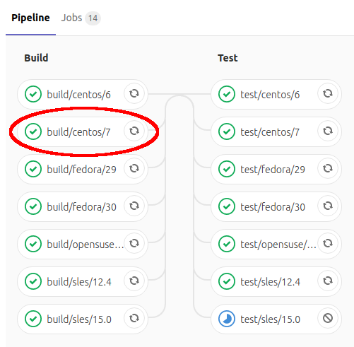
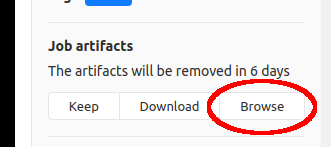

# Release Workflow

## Preparations

Specify the release version.

```
VERSION=2.7.0
```

Add your signing key to your Git configuration file, if not already there.

```
vim $HOME/.gitconfig

[user]
        email = michael.friedrich@icinga.com
        name = Michael Friedrich
        signingkey = D14A1F16
```

### Issues

Check issues at https://github.com/Icinga/icingaweb2

### Backport Commits

For minor versions not branched off git master you need
to manually backport any and all commits from the
master branch which should be part of this release.

### Authors

Update the [.mailmap](.mailmap) and [AUTHORS](AUTHORS) files:

```
git log --use-mailmap | grep '^Author:' | cut -f2- -d' ' | sort | uniq > AUTHORS
```

## Version

Update the version in the following files:

* [VERSION](VERSION)
* Application Version: [library/Icinga/Application/Version.php](library/Icinga/Application/Version.php)
* Module Versions in `modules/*/module.info`

Commands:

```
echo "v$VERSION" > VERSION
sed -i "s/const VERSION = '.*'/const VERSION = '$VERSION'/g" library/Icinga/Application/Version.php
find . -type f -name '*.info' -exec sed -i "s/Version: .*/Version: $VERSION/g" {} \;
```

## Changelog

Choose the most important issues and summarize them in multiple groups/paragraphs. Provide links to the mentioned
issues/PRs. At the start include a link to the milestone's closed issues.

Make sure to check for issues/PRs with the label `affects-upgrades` and include them in
the [upgrading documentation](doc/80-Upgrading.md).

## Git Tag

```
git commit -v -a -m "Release version $VERSION"
```

Create a signed tag (tags/v<VERSION>) on the `master` branch (for major
releases) or the `support` branch (for minor releases).

```
git tag -s -m "Version $VERSION" v$VERSION
```

Push the tag:

```
git push v$VERSION
```

**For major releases:** Create a new `support` branch:

```
git checkout master
git checkout -b support/2.7
git push -u origin support/2.7
```

## Package Builds

### RPM Packages

```
git clone git@git.icinga.com:packaging/rpm-icingaweb2.git && cd rpm-icingaweb2
```

### DEB Packages

```
git clone git@git.icinga.com:packaging/deb-icingaweb2.git && cd deb-icingaweb2
```

### Branch Workflow

Checkout `master` and create a new branch.

* For releases use x.x[.x] as branch name (e.g. 2.7 or 2.7.1)
* For releases with revision use x.x.x-n (e.g. 2.7.0-2)

### Switch Build Type (For RPM and DEB)

Edit file `.gitlab-ci.yml` and comment variable `ICINGA_BUILD_TYPE` out.

```yaml
variables:
  ...
  #ICINGA_BUILD_TYPE: snapshot
  ...
```

Commit the change.

```
git commit -av -m "Switch build type for $VERSION-1"
```

#### RPM Release Preparations

Set the `Version`, `revision` and `%changelog` inside the spec file:

```
sed -i "s/Version:.*/Version:        $VERSION/g" icingaweb2.spec

vim icingaweb2.spec

%changelog
* Tue Jul 30 2019 Johannes Meyer <johannes.meyer@icinga.com> 2.7.0-1
- Update to 2.7.0
```

#### DEB Release Preparations

Update file `debian/changelog` and add at the beginning:

```
icingaweb2 (2.7.0-1) icinga; urgency=medium

  * Release 2.7.0-1

 -- Eric Lippmann <eric.lippmann@icinga.com>  Tue, 30 Jul 2019 09:28:52 +0000

```

### Release Commit (For RPM and DEB)

Commit the changes and push the branch.

```
git commit -av -m "Release $VERSION-1"
git push origin 2.7
```

Gitlab will now build snapshot packages based on the tag `v2.7.0` of Icinga Web 2.

### Package Tests

In order to test the created packages you can download a job's artifacts:

Visit [git.icinga.com](https://git.icinga.com/packaging/rpm-icingaweb2)
and navigate to the respective pipeline under `CI / CD -> Pipelines`.

There click on the job you want to download packages from:



The job's output appears. On the right-hand sidebar you can browse its artifacts:



Once there, navigate to `build/RPMS/noarch` where you'll find the packages.

### Release Packages

To build release packages and upload them to [packages.icinga.com](https://packages.icinga.com)
tag the release commit and push it.

```
git tag -s 2.7.0-1
git push origin 2.7.0-1
```

Now cherry pick the release commit to `master` so that the changes are transferred back to it.

**Attention**: Only the release commit. *NOT* the one switching the build type!

## Release Tests

* Provision the vagrant boxes and test the release packages.
* * Start a new docker container and install/run Icinga Web 2 & icingacli.

### CentOS

```
docker run -ti centos:latest bash

yum -y install https://packages.icinga.com/epel/icinga-rpm-release-7-latest.noarch.rpm
yum -y install centos-release-scl
yum -y install icingaweb2 icingacli
icingacli
```

### Debian

```
docker run -ti debian:stretch bash

apt-get update && apt-get install -y wget curl gnupg apt-transport-https

DIST=$(awk -F"[)(]+" '/VERSION=/ {print $2}' /etc/os-release); \
 echo "deb https://packages.icinga.com/debian icinga-${DIST} main" > \
 /etc/apt/sources.list.d/${DIST}-icinga.list
 echo "deb-src https://packages.icinga.com/debian icinga-${DIST} main" >> \
 /etc/apt/sources.list.d/${DIST}-icinga.list

curl https://packages.icinga.com/icinga.key | apt-key add -
apt-get -y install icingaweb2 icingacli
icingacli
```

## GitHub Release

Create a new release for the newly created Git tag: https://github.com/Icinga/icingaweb2/releases

> Hint: Choose [tags](https://github.com/Icinga/icingaweb2/tags), pick one to edit and
> make this a release. You can also create a draft release.

Use the changelog for the release body.

## Online Documentation

This is built with a daily cronjob.

### Manual Updates

SSH into the webserver or ask [bobapple](https://github.com/bobapple).

```
cd /usr/local/icinga-docs-tools && ./build-docs.rb -c /var/www/docs/config/icingaweb2-latest.yml
```

## Announcement

* Create a new blog post on [icinga.com/blog](https://icinga.com/blog) including a featured image
* Create a release topic on [community.icinga.com](https://community.icinga.com)
* Release email to net-tech & team

## Project Management

* Add new minor version on [GitHub](https://github.com/Icinga/icingaweb2/milestones).
* Close the released version on [GitHub](https://github.com/Icinga/icingaweb2/milestones).
